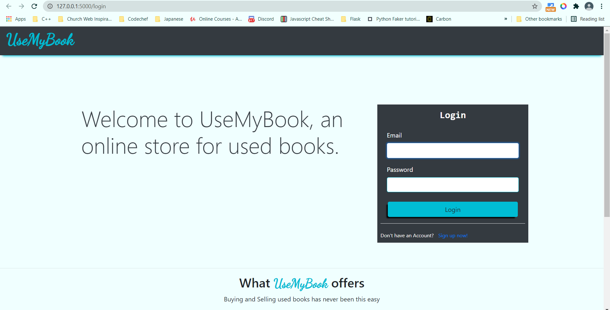
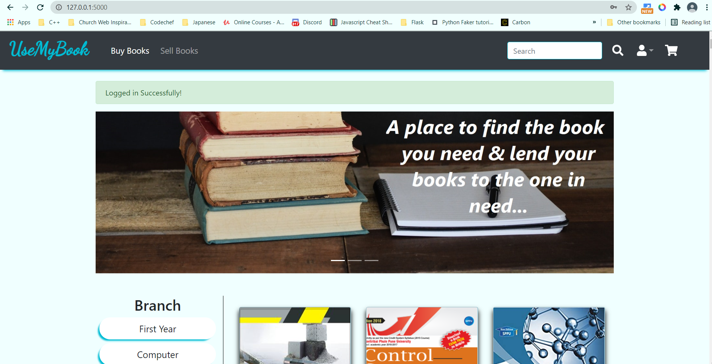
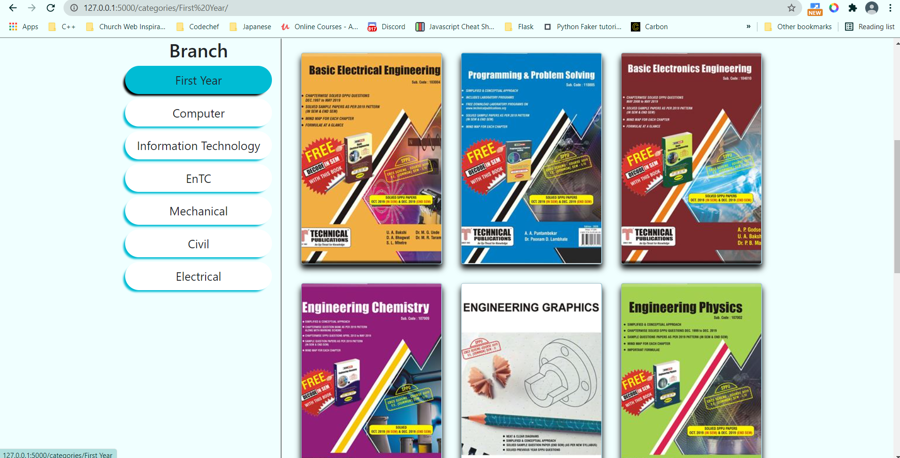
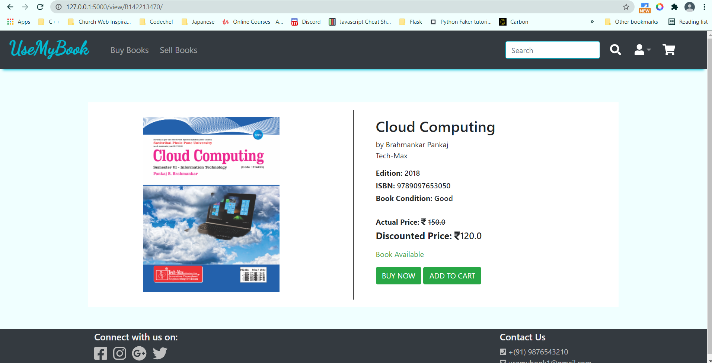
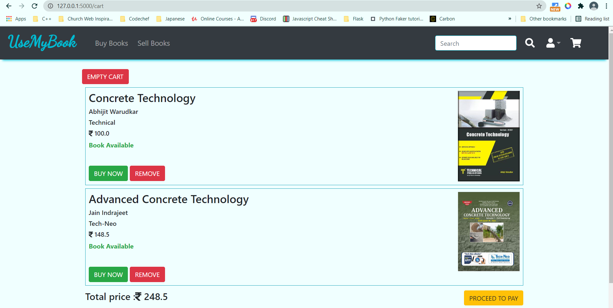
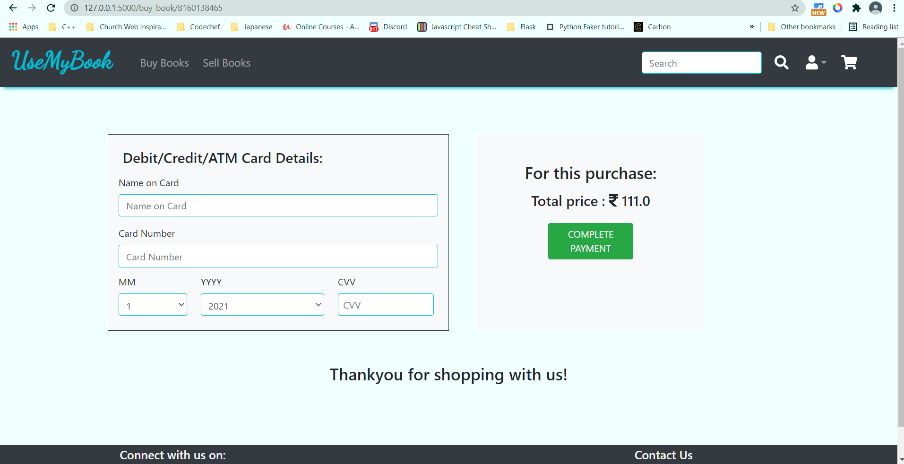
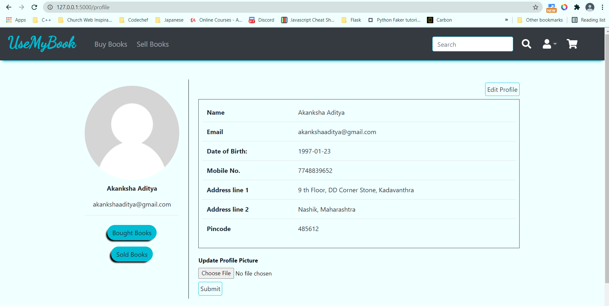
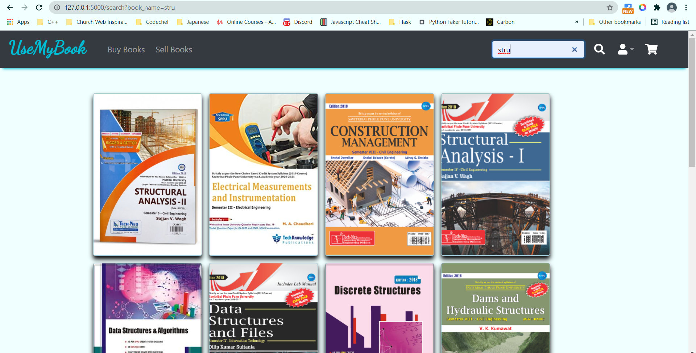
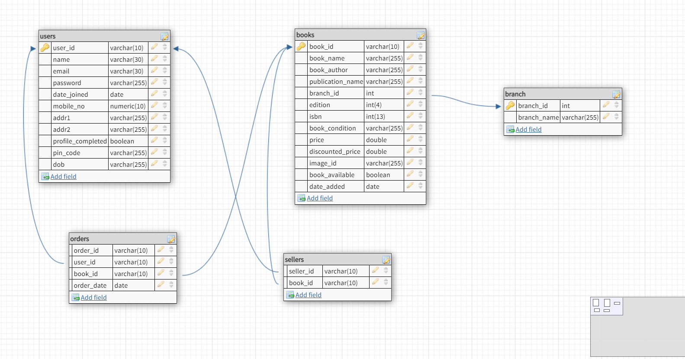

# UseMyBook
## A Second Hand Bookstore
---
“UseMyBook – A Second Hand Bookstore” s a project about a Bookstore database application.

The main objective of this application is to provide a system where 
students/retailers can buy and sell used books. Every year new batch of 
students need books for their academic year and at the same time the 
need of those books for the previous batch is over. The ones who don’t 
need the books anymore find it difficult to get in contact with a willing 
buyer. This website bridges the gap between the seller and the buyer by 
providing a convenient medium for this purpose.
 After the successful login the user can view all the books being sold 
by other costumers. The main point of developing this system is to make 
it easier to buy and sell used books. In this system user can search for the 
book of his choice and also according to the branch. The user is capable of
buying as well as selling using the same login

**Login Page**

**Homepage**

**Categories**

**Viewing a book**

**Cart**

**Buy book**

**Add book**

**Profile**

**User Books**

**Search book by name**

**Schema**

